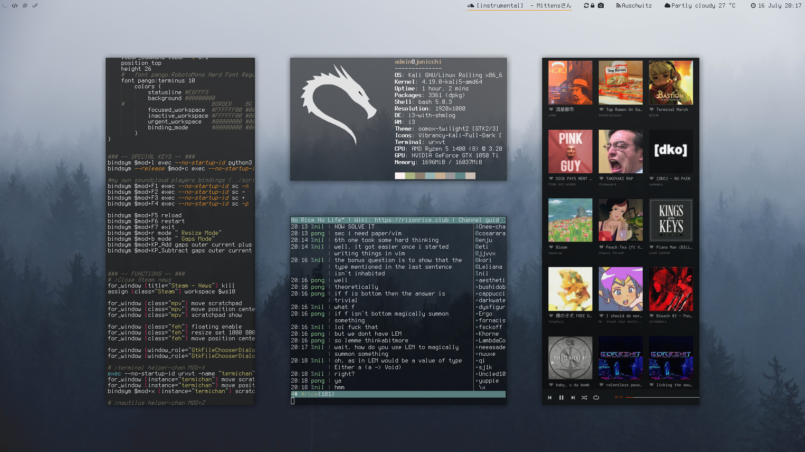

# Junicchi's Linux Rice

## Preferences
 - Current playing souncloud track to status bar [script](https://github.com/KebabLord/dotfiles/blob/master/i3/scripts/soundcloud)
 - Gaps Mode, which you can easily manage inner/outer/vertical/horizontal gaps and switch between gaps profiles
 - Disable steam news popup
 - Keep an urxvt and nutilus dropdown in background
 - A full transparent minimal bar
 - Characters rather than numbers as workspace names with static sequance
 - [Bash aliases](https://github.com/KebabLord/dotfiles/blob/master/.bash_aliases) with handy functions

## Other dotfiles
 - Rofi theme, mosaic screen locker script
 - Compton config for window shadows and soft transition effect
 - Xresources and Xdefautls for terminal (urxvt) colors
 - Sublime text keybindings and config
 - Qutebrowser custom search methods

## Other Screenshots
 
 
 
