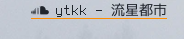
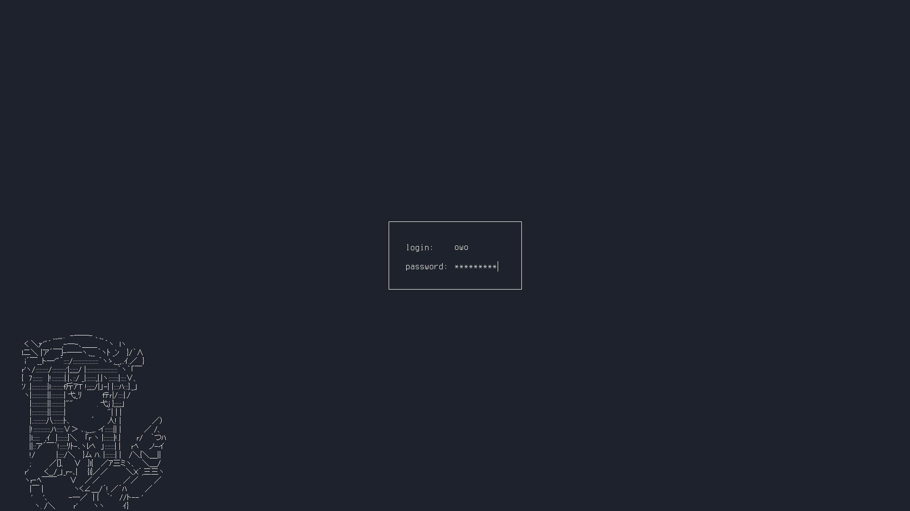
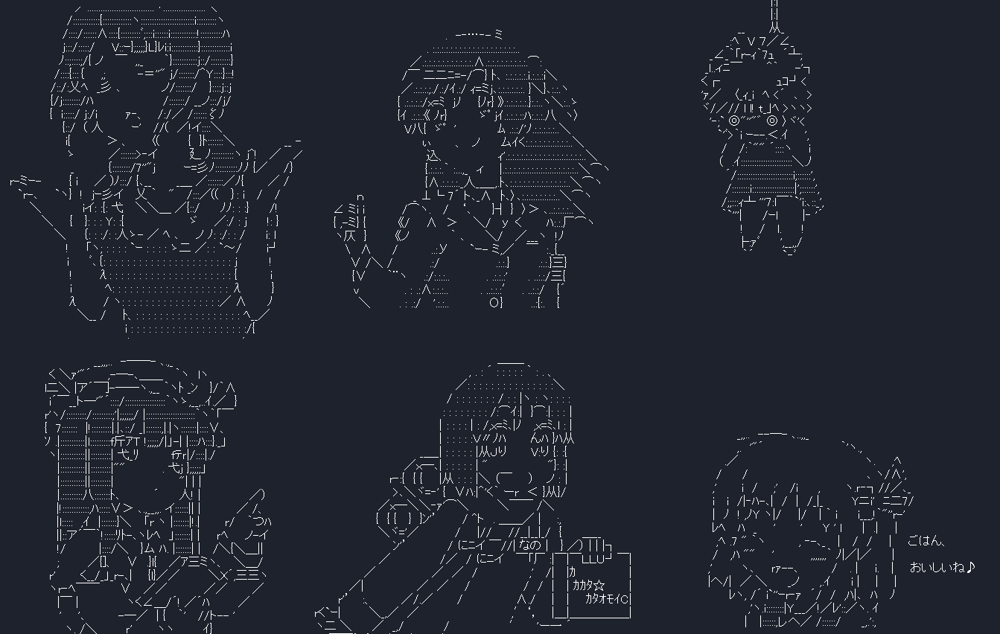
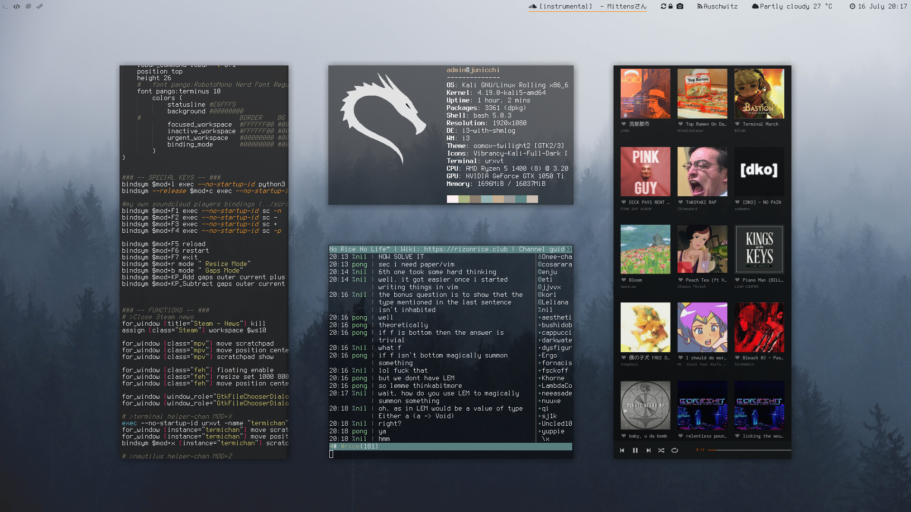
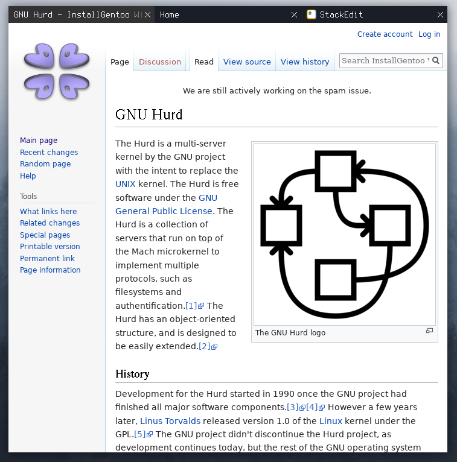

# Junicchi's Linux Rice
this repo is mostly my dump but also has some innovative and useful stuff.

## What's new?
 - Current playing souncloud track to status bar [script](https://github.com/KebabLord/dotfiles/blob/master/i3/scripts/soundcloud)
 - Gaps Mode, which you can easily manage inner/outer/vertical/horizontal gaps and switch between gaps profiles
 - A full transparent minimal bar with characters rather than numbers as workspace names with static sequance.
 - [Bash aliases](https://github.com/KebabLord/dotfiles/blob/master/.bash_aliases) full of shit functions, file uploaders and a terminal/explorer dropdowns in background 
 - My useless scripts like terminal urlLauncher with proxy, terminal smart tv controller and terminal radio

# Slim Lock Screen

selects a random ascii art everytime, here is the list: 

## Old rice
Old rice is in [this branch](https://github.com/KebabLord/dotfiles/tree/kali_rice) if you're interested
 

## Firefox:
 
