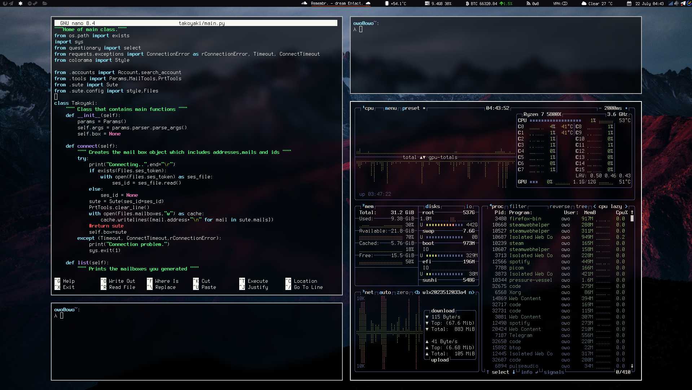
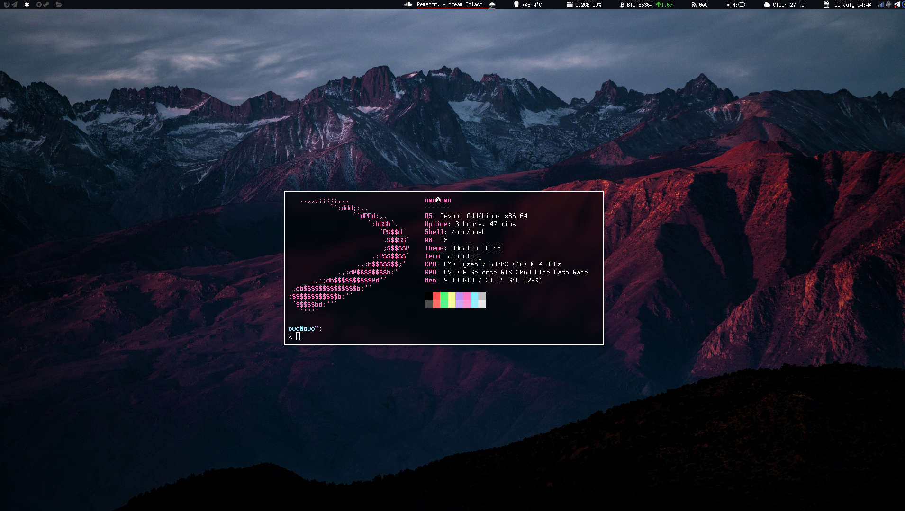
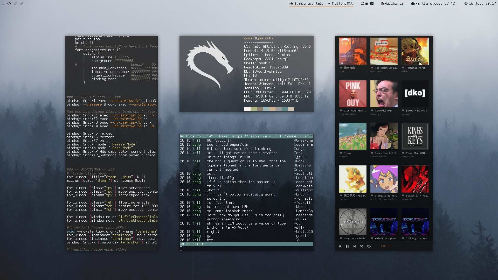
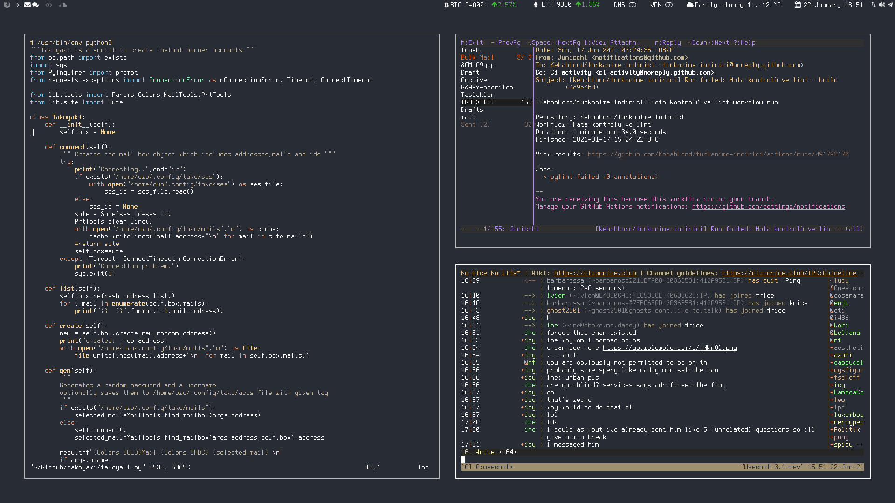

# Juchi's Linux Rice
this repo is mostly my dump but also has some innovative and useful stuff.

## Worth mentioning
 - Gaps Mode, which you can easily manage inner/outer/vertical/horizontal gaps and switch between gaps profiles
 - A full transparent minimal bar with characters rather than numbers as workspace names with static sequance.
 - Some [Bash aliases](https://github.com/KebabLord/dotfiles/blob/master/.bash_aliases), file uploaders and stuff 
 - My useless terminal scripts like smart tv controller etc.

## Old rice
Old rice (2019) [browse](https://github.com/KebabLord/dotfiles/tree/kali_rice)
 

Old rice (2021) [browse](https://github.com/KebabLord/dotfiles/tree/77b219bfd3b2720d9b9a52e2d65c6508cac4a438)
 

## Firefox:
It's broken after an update need to fix it sometime.
 
