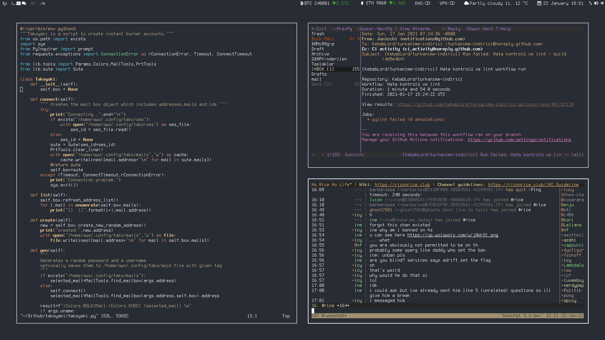

# Junicchi's Linux Rice
i3gaps, i3blocks, Urxvt, Subl, qutebrowser and various dotfiles are contained in this repo. Steal this rice.

## i3gaps Features
 - Disable steam news popup
 - Use any terminal as dropdown
 - Nautilus dropdown
 - Gaps Mode, which you can easily manage inner/outer/vertical/horizontal gaps and switch between gaps profiles
 - Set wallpaper with feh
 - A full transparent minimal bar
 - Characters rather than numbers as workspace names with static sequance

## Other dotfiles
 - Rofi theme, mosaic screen locker script
 - Compton config for window shadows and soft transition effect
 - Xresources and Xdefautls for terminal (urxvt) colors
 - Sublime text keybindings and config, so you can get a borderless sublime view
 - Handy bash_aliases and the bashrc
 - Qutebrowser with custom soundcloud theme and search engines