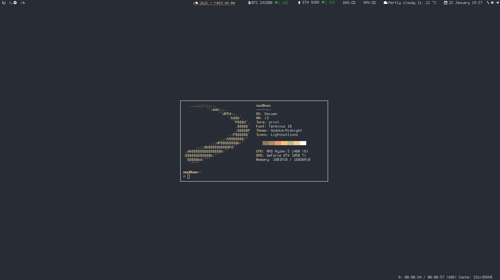

# Junicchi's Linux Rice
using same rice on kali, d*bian and devuan. this repo is mostly my dump but also has some innovative and useful stuff.

## What's new?
 - Current playing souncloud track to status bar [script](https://github.com/KebabLord/dotfiles/blob/master/i3/scripts/soundcloud)
 - Gaps Mode, which you can easily manage inner/outer/vertical/horizontal gaps and switch between gaps profiles
 - A full transparent minimal bar with characters rather than numbers as workspace names with static sequance.
 - [Bash aliases](https://github.com/KebabLord/dotfiles/blob/master/.bash_aliases) full of shit functions and a terminal/explorer dropdowns in background 

# Slim Lock Screen

selects a random ascii art everytime, here is the list: 

## Other Screenshots
 
 
 
